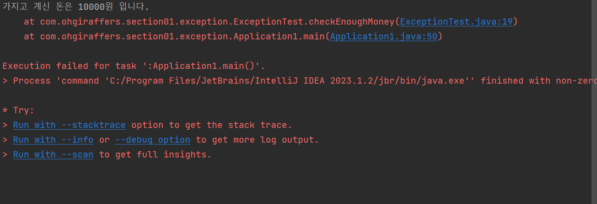

### chap13 
***
#### 예외 처리
- 컴퓨터 프로그램이 동작하는 도중에 예상치 못한 사태가 발생하여 실행중이 프로그램이 영향을 받는 것을 오류 와 ㅇㅖ외 두가지로 구분 할수있다

- 1.오류:심각한 문제가 발생하여 실행중인 프로그램이 종료되는 것,
- 이러한 오류는 개발자가 미치예측하여 처리하는 것이 불가능하며 오류에 대한 처리는 할 수 없다

- 2.예외:오류와 마찬가지로 실행중인 프로그램을 비정상적으로 종료시키지만 발생 할 수 있는 상황을 미리 예측하여 처리 할 수 있다

****
##### 강제로 예외 발생
- throw new 예외 클래스명();
- 예외 처리방법
- 1. throws로 위임
- 2. try-catch로 처리
ex)
```
public static void main(String[] args) throws Exception { <--//클래스에 throws로 위임
    ExceptionTest et = new ExceptionTest(); //예외처리해야하는 메소드 생성자 생성
    et.checkEnoughMoney(10000, 50000); //정상작동
    et.checkEnoughMoney(50000, 10000); // 메소드에서 money가 더클경우 예외처리가 발생한다
    //밑에 사진과 같이 예외처리 문구가 나온다

```

***
##### try-catch문으로 해결
```
	ExceptionTest et = new ExceptionTest();// 생성자 생성후
	try{
	        et.checkEnoughMoney(10000,50000); //예외 발생가능성이 있는 구문을 try블럭안에서 호출한다
	        }
	catch (Exception e){
	       System.out.println("================ 상품 구입 불가 ====================");
	       // try구문 안에서 오류가 발생하면 catch 블럭에 있는 코드를 실행한다
	        }
```
***
#### 사용자 정의의 예외 클래스
- 사전에 정의되어 있는 Exception의 종류는 굉장히 많다
- 하지만  Runtime Exception의 후손대부분은 간단한 조건문으로 처리가 가능하기 때문에 따로 강제화 하지 않는다
- 사전의 정의 된 예외 클래스 외에 따로 원하는 명칭의 예외클래스를 만들수 있다
```agsl
try {
			et.checkEnoughMoney(30000, 50000);
			
		} catch (Exception e) {
			e.printStackTrace(); // 따로 만든 예외 처리 클래스로 동작
		}
```